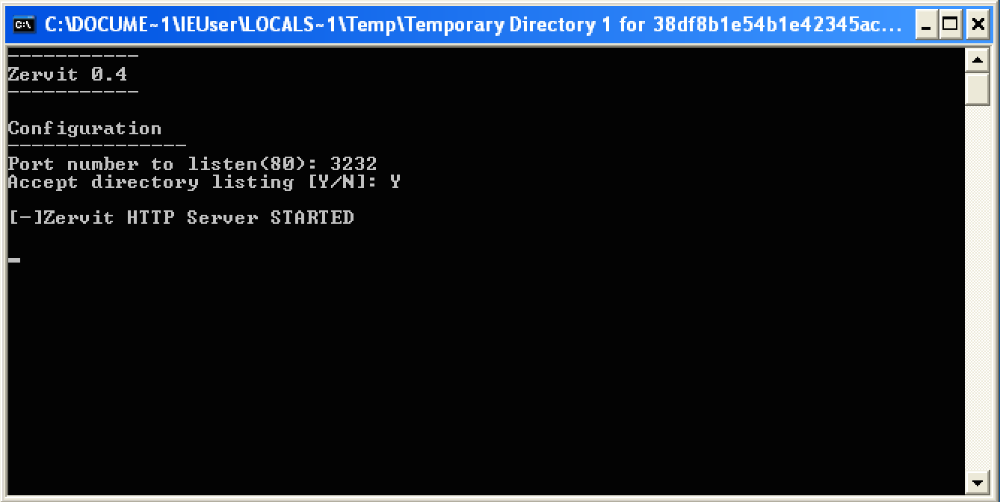
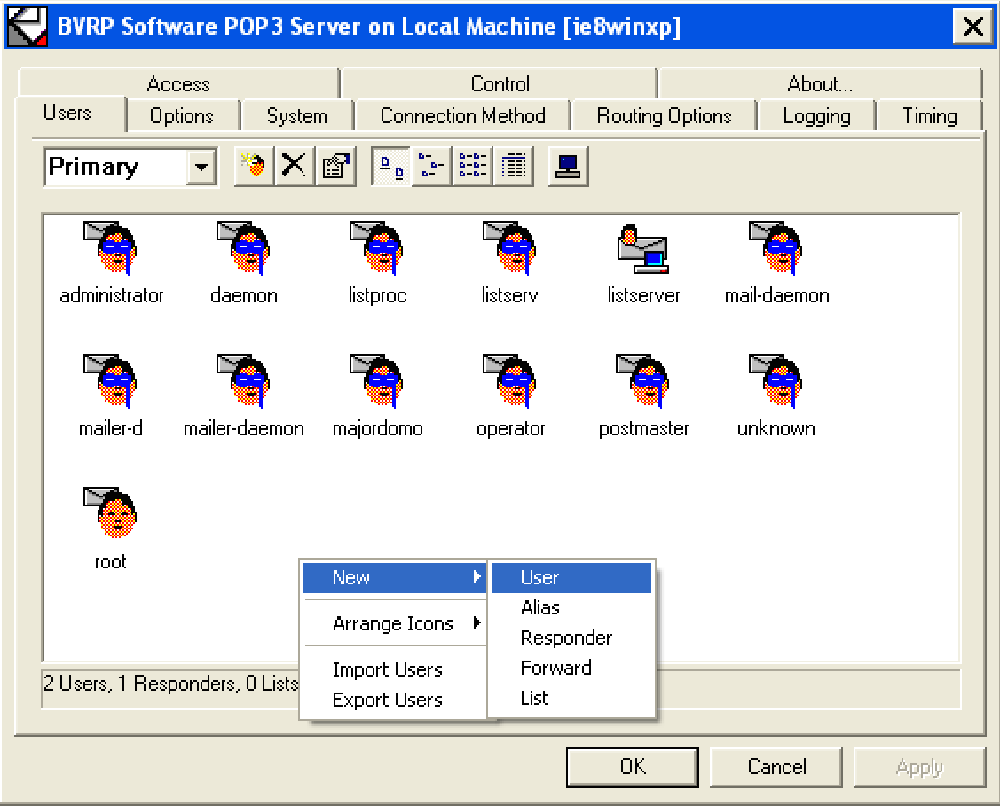
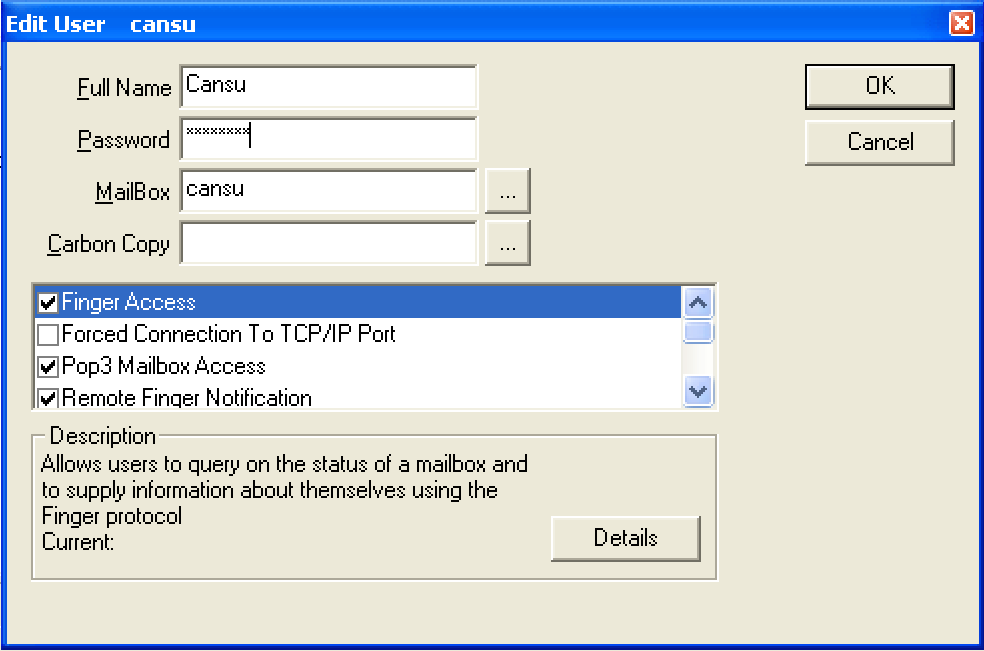
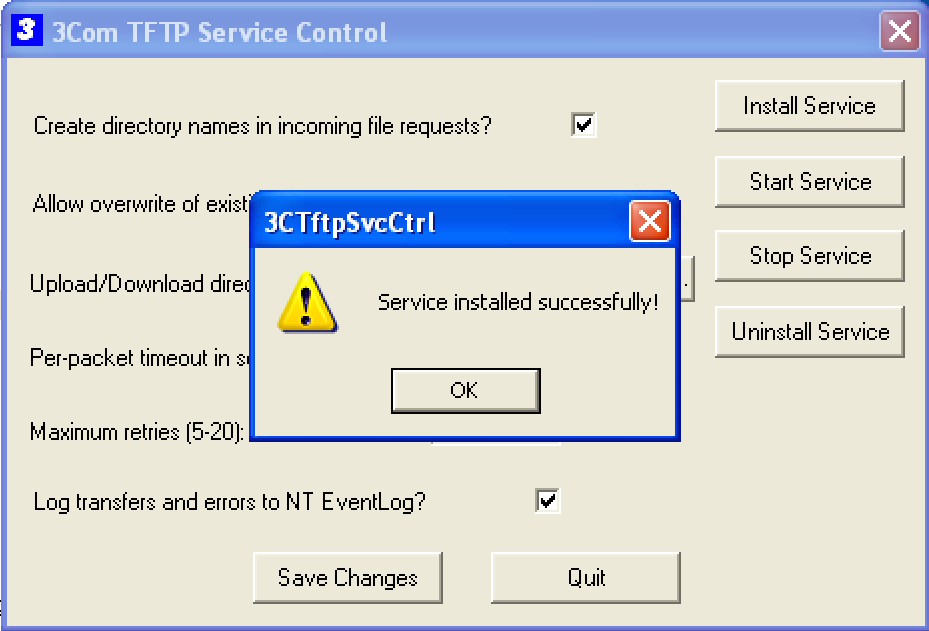
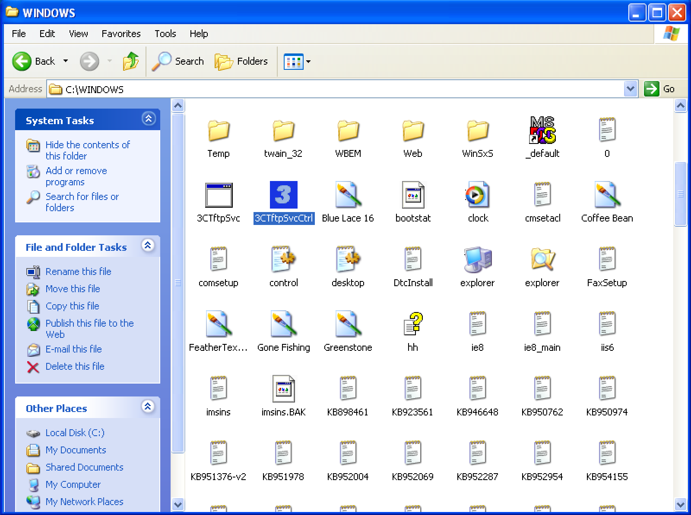

### Hedef Sanal Makineler

* Ubuntu
* Windows XP SP3
* Winwows 7 SP1

Yapacağımız saldırı denemelerinde kullanmak amaçlı kendimize __Ubuntu__, __Windows XP__ ve __Windows 7__ olmak üzere 3 sanal makine daha kurmamız lazım. İnternette bu sistemlerin sanallaştırılmış versiyonları mevcuttur.

İlk önce VMware dosyalarımızı indirelim:

* __Ubuntu:__ http://www.mininova.org/tor/13274076 (torrent)

* __Windows:__ http://dev.modern.ie/tools/vms/#downloads

    * Windows XP
        Virtual Machine: __IE on XP__
        Select Platform: __VMware__

    * Windows 7
        Virtual Machine: __IE10 on Win7__
        Select Platform: __VMware__

![k1]

Dosya indirme işlemi tamamlandıktan sonra, artık bir tıklama ile hem Windows hem Ubuntu sistemlerini çalıştırabiliriz. İsterseniz internetten iso dosyalarını indirerek, sıfır kurulum da yapılabilir, seçenek sizin.. Biz kolaya kaçıyoruz.. VMware çalıştırdığınızda son olarak karşınıza çıkacak ekran çıktısı aşağıda verilmiştir. Şimdi ise tek tük ayarlar kaldı onlarla devam edelim.

![k2]

#### Ubuntu

![ubuntu]

Ubuntu sanal makinemizi çalıştırmak için, verdiğim linkten indirmeniz yeterlidir. Herhangi bir ayar yapmaya gerek yoktur. İndireceğiniz dosya 7zip dosyasıdır, aşağıda vereceğim linkleri kullanarak açabilirsiniz. Şifresi: _1stPentestBook?!_ İlk çalıştırdığınızda VMware sizden birşeyler isteyecektir, orda __I copied it__ diyerek geçebilirsiniz. Sisteme giriş yapmak için kullanıcı adı: _georgia_, şifre: password. Hiçbir güncelleme yapmayın.

* Win: http://www.7-zip.org/download.html
* Mac: http://ez7z.en.softonic.com/mac

#### Windows XP

![winxp]

##### Windows Güvenlik Duvarını Kapatma

Başlat menüsünden __Control Panel__ açalım, ordan __Security Center > Windows Firewall__ gelerek güvenlik duvarını resimde olduğu gibi kapatalım.

![k3]

##### Kullanıcı Parolası

__Control Panel__ kapatmadan, gene ordan __User Accounts__ açalım. Mevcut kullanıcıya __Create a password__ diyerek yeni parola atayalım. Ve ismi: _security_ şifresi de: _security_ olan bir kullanıcı daha ekleyelim.

![k4]

##### Statik IP Adres Ayarı

Denemelerimizin devamında IP adreslerimizin her defasında değişmemesi için statik bir IP adres verelim. Bu yapmadan, sistemimizin _Bridge Network Mode_ kullandığına VMware ayarlarından emin olmamız lazım, sonrasında ise otomatik verilen IP öğreneceğiz. __Start > Run__ dan __cmd__ yi açalım, ve karşımıza çıkan ekranda `ipconfig` yazalım. Bu bize şu anda kullanmakta olduğumuzun network ayarlarını gösterecektir.

![k5]

Bu bilgilere ulaştıktan sonra,
    1. __Control Panel > Network and Internet Connections > Network Connections__ gidelim
    2. Ordan __Local Area Connection__ sağ tıklayıp __Properties__ açalım. 3. __Internet Protocal (TCP/IP)__ seçerek __Properties__ basalım. yukarda aldığımız sonuçları aşağıdaki şekilde girelim.

![k6]

İşlem başarılı tamamlandımı, onu kontrol etmek için __Kali__'mizi açalım, terminalde `ping [windows_ip_aresi]` komutunu çalıştıralım.

```ShellSession
root@kali:~# ping 192.168.2.240
PING 192.168.20.10 (192.168.20.10) 56(84) bytes of data.
64 bytes from 192.168.20.10: icmp_req=1 ttl=128 time=3.06 ms
^C
```

`ping` sonsuza kadar çalışır, o yüzden __Ctrl+C__ yaparak işlemi kesebiliriz.

Benim girdiğim IP _192.168.2.240_, siz ona göre kendi bilgisayarınızda aldığınız sonuçlara bakarak değişiklik yaparsınız. `ping` komutu çalıştırdıktan sonra `64 bytes from 192.168.20.10: icmp_req=1 ttl=128 time=3.06 ms` bu satırı görüyorsak, demekki ayarlarımız doğru yapmışız ve Kali ile Windows sanal makinelerimiz aynı network altında çalışmakta. Zaten normal bilgisayarınızda bile aşağıdakiye benzer bir ekranla karşılaşabilirsiniz. Yani burdaki _samsung_ normal bilgisayar, _ie8winxp_ ise sanal makine.

![k7]

##### XP'mizi Windows Domain'in bir Üyesi gibi yapma

Son olarakta, kurduğumuz Windows XP sistemini normal bir windows domain'in üyesiymiş gibi yapmayı ögreneceğiz.

1. __Start > Run__ seçerek `secpol.msc` komutu ile Local Security Setting Panel'ini açalım.
2. Soldaki __Local Policies__ seçeneğini genişleterek, sağda __Security Options__ üstüne çift tıklayalım.
3. Sağdaki Policy listesinden __Network access: Sharing and security model for local accounts__ çift tıklayıp, __Classic-local users authenticate as themselves__ seçelim.

![k8]


##### Savunmasız Yazılım Yükleme

Saldırılarda kullnamak üzere birkaç tane savunmasız proğram yükleyeceğiz. İlerleyen konularda bu tür yazılımlara nasıl saldırı düzenleneceği hakkında detaylı göreceğiz. Windows XP sistemimize aşağıdakileri kuralım:

###### Zervit 0.4

http://www.exploit-db.com/exploits/12582/ adresinden Zervit 0.4 sürümünü indirelim. Seçeneklerden _Vulnerable App_ seçelim. İndirmiş olduğumuz zip dosyasını açalım ve _Zervit_ programını çalıştıralım. Program başladığında port numarası isteyecektir __3232__ girelim. Herhangi bir sebeple Windows yeniden başlattığınızda _Zervit_ servisi kendisi yeniden çalıştırmayacaktır, tekrar kendimiz çalıştırmamız gerekir.



###### SLMail 5.5

http://www.exploit-db.com/exploits/638/ adresinden SLMail 5.5 sürümünü indirelim ve çalıştıralım. Kurulum süresince hep varsayılan değerlerle __Next__ diye geçiyoruz, ancak _domain name_ hakkında uyarı aldığnızda onu da __OK__ basalım geçelim.

SLMail kurulumu tamamlanınca, sanal makinemizi yeniden başlatalım. Sonra __Start > All Programs > SL Products > SLMail > SLMail Configuration__ giderek _Users_ sekmesinde resimdeki gibi __New > User__



Yeni oluşturulan kullanıcı simgesinin üstüne basarak, __cansu__ olarak isim girelim. Sonrasında açılan pencerede:



###### 3Com TFTP 2.0.1

Sonra, http://www.exploit-db.com/exploits/3388/ adresinden 3Com TFTP 2.0.1 sürümünü indirelim. Zip dosyasından açalım ve _3CTftpSvcCtrl_ ve _3CTftpSvc_ dosyalarını _C:\Windows_ dizinine atalım



_3CTftpSvcCtrl_ dosyasını açalım ve __Install Service__ basalım:



Sonrasında 3Com TFTP programını başlatmak için __Start Service__ basalım. Bundan sonra Windows XP makinemizi yeniden başlatsak bile, kendisi otamatik olarak açılışta çalışacaktır, __Quit__ diyerek çıkalım.

###### XAMPP 1.7.2

Şimdi XAMPP proğramının eski sürümlerinden bir tanesini kuralım; Onun için http://www.oldapps.com/xampp.php?old_xampp=45/ adresine gidelim ve indirelim. İndirme yaparken herhangi bir sıkıntıyla karşılaşırsanız, normal bilgisayarınızda indirip sonra sanal makineye atabilirsiniz.

1. Kurulum dosyasını çalıştıralım ve varsayılan değerler ile devam edelim. Kurulum tamamlandıktan sonra, ilk seçeneği __1. start XAMPP Control Panel,__ seçelim.

2. XAMPP Control Panel'inde __install__ basarak _Apache, MySQL ve FileZilla_ servislerini kuralım (__Svc__ seçeneğini işaretli olarak) ve herbiri __Start__ basarak başlatalım. Son olarak ekran çıktısı:

3. XAMPP Control Panel'inde _FileZilla_ için __Admin__ butonunu basalım, _Admin paneli:_

4. _Users_ penceresini açmak için __Edit > Users__ gidelim

5. Pencerenin sağ kısmında __Add__ basalım

6. _Add User Account_ penceresinde, __cansu__ girelim ve __OK__

7. _cansu_ seçiliyken, _Account Settins_ altında bulunan __Password__ kutusunu işaretleyelim ve parola __password__ olarak girelim

__OK__ basalım.

###### Adobe Acrobat Reader

###### War-FTP

###### WinSCP

###### Immunity Debugger ve Mona Kurulumu

#### Windows 7

Verdiğimiz linkten Windows 7 sistemini de indirdikten sonra, Windows XP olduğu gibi otomatik güncellemeyi kapatalım ve network ayarlarına giderek statik IP adresi belirleyelim. İndirdiğimiz Windows 7 sisteminin kullanıcı şifresi varsayılan olarak: __Passw0rd!__ Şimdi ise, denemelerimiz için lazım olacak bazı programların kurulumunu yapalım.

* Java 7 Update 6 (Java'nın tarihi geçmiş versiyonu): http://www.oldapps.com/java.php?old_java=8120/
* Winamp 5.55 versiyonu: http://www.oldapps.com/winamp.php?old_ winamp=247/
* Mozilla Firefox'un son sürümünü: http://www.mozilla.org/
* Microsoft Security Essentials: http://windows.microsoft.com/en-us/windows/security-essentials-download/ Kurulumunu yaptıktan sonra otomatik güncelleme önerisini ve korumasını şimdilik kapatıyoruz. __Real-time Protection > Turn on real-time protection (recommended) işaretini kaldır > Save changes__
* Son olarak ta, yukarıda torrentle indirmiş olduğumuz __BookApp__ web uygulamasını kuralım. Sürükle & bırak yaparak sistemimizden Windows 7'ye atalım.  
    [KURULUMU](BookApp.md)


TODO: windows7

Tebrik ederim! Hedef sanal makinelerimizin kurulumunu tamamlamış bulunmaktayız. Yorucu bir gündü.. Birazda kafa dağıtmaya ne dersiniz? Ubuntu açalım, ordan __Games > Nibbles__ oyununu açalım.. öyle devam ederiz..

![nibbles]

[k1]: ../resim/hedef/k1.png
[k2]: ../resim/hedef/k2.png
[k3]: ../resim/hedef/k3.png
[k4]: ../resim/hedef/k4.png
[k5]: ../resim/hedef/k5.png
[k6]: ../resim/hedef/k6.png
[k7]: ../resim/hedef/k7.png
[k8]: ../resim/hedef/k8.png
[ubuntu]: ../resim/hedef/ubuntu.png
[winxp]: ../resim/hedef/winxp.png
[nibbles]: ../resim/hedef/nibbles.png


